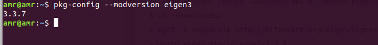
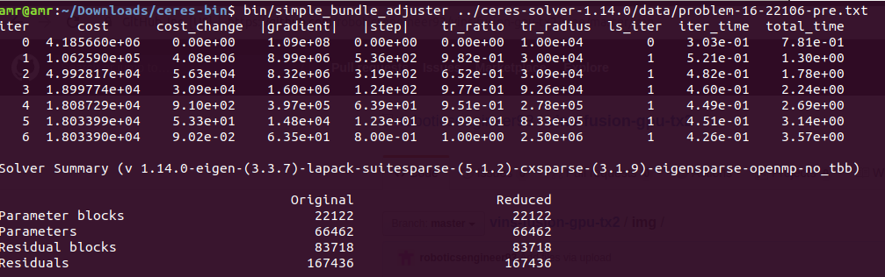
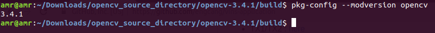
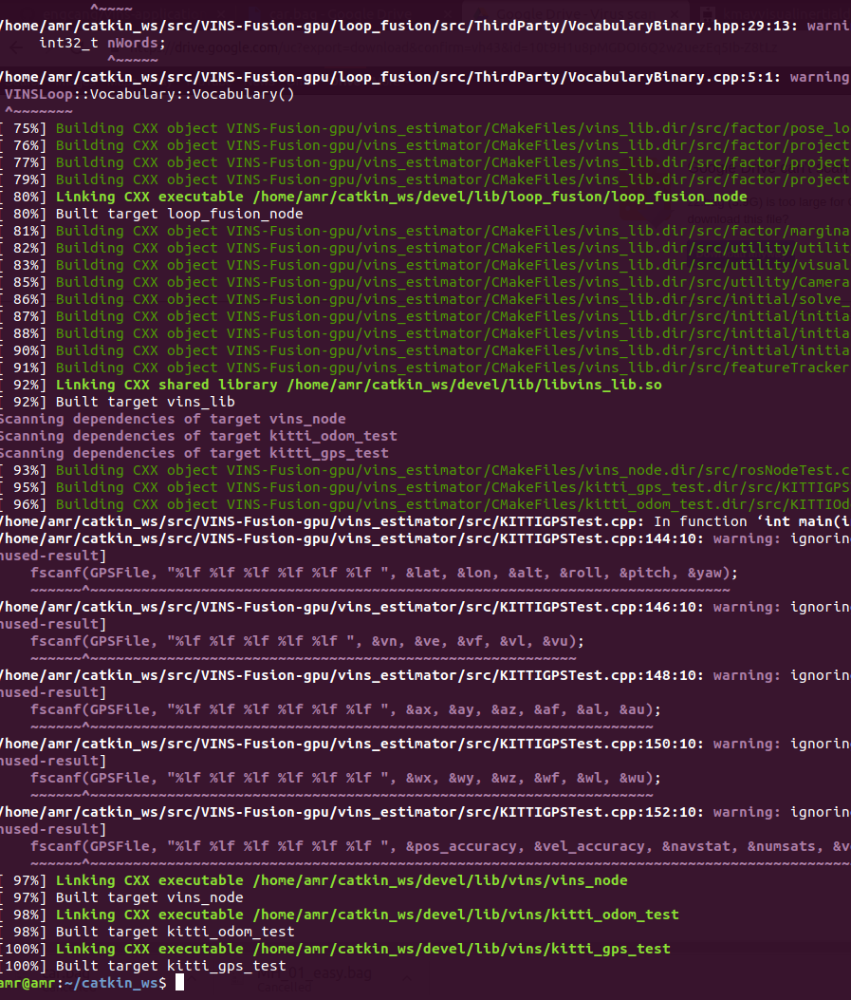
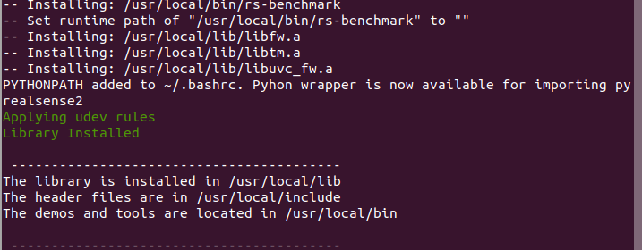
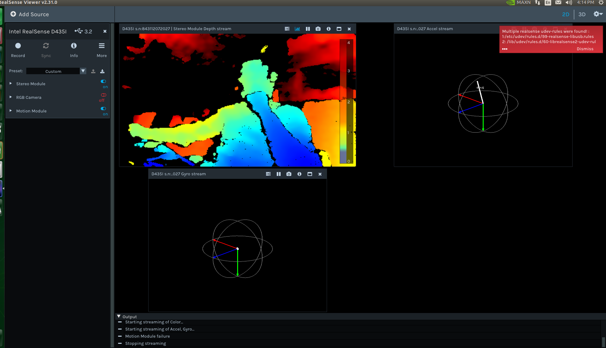

# vins-fusion-gpu-tx2-nano
Installation step of vins-fusion gpu version on Nvidia Jetson TX2 and Jetson Nano ( JP 4.2.2)
# Prerequisites


### Eigen 
```
$ sudo apt-get remove libeigen3-dev #  Remove preb-uilt Eigen
$ cd ~/Downloads/
$ wget -O eigen.zip http://bitbucket.org/eigen/eigen/get/3.3.7.zip #check version
$ unzip eigen.zip -d eigen-3.3.7
$ mkdir eigen-build && cd eigen-build
$ cmake ../eigen-3.3.7/ && sudo make install
$ pkg-config --modversion eigen3 # Check Eigen Version
```


### Ceres solver 
```
$ cd ~/Downloads/
$ sudo apt-get install -y cmake libgoogle-glog-dev libatlas-base-dev libsuitesparse-dev
$ wget http://ceres-solver.org/ceres-solver-1.14.0.tar.gz
$ tar zxf ceres-solver-1.14.0.tar.gz
$ mkdir ceres-bin
$ mkdir solver && cd ceres-bin
$ cmake ../ceres-solver-1.14.0 -DEXPORT_BUILD_DIR=ON -DCMAKE_INSTALL_PREFIX="../solver" 
  #good for build without being root privileged and at wanted directory
$ make -j3 # 6 : number of cores
$ make test
$ make install
$ bin/simple_bundle_adjuster ../ceres-solver-1.14.0/data/problem-16-22106-pre.txt # to check version
```


## Opencv
```
# remove prebuilt opencv
$ sudo apt-get purge libopencv* python-opencv 
$ sudo apt-get update
$ sudo apt-get install -y build-essential pkg-config

## libeigen3-dev # recommend to build from source

$ sudo apt-get install -y cmake libavcodec-dev libavformat-dev libavutil-dev \
    libglew-dev libgtk2.0-dev libgtk-3-dev libjpeg-dev libpng-dev libpostproc-dev \
    libswscale-dev libtbb-dev libtiff5-dev libv4l-dev libxvidcore-dev \
    libx264-dev qt5-default zlib1g-dev libgl1 libglvnd-dev pkg-config \
    libgstreamer1.0-dev libgstreamer-plugins-base1.0-dev mesa-utils     
$ sudo apt-get install python2.7-dev python3-dev python-numpy python3-numpy
```

```
# To fix OpenGL related compilation problems 

$ cd /usr/lib/aarch64-linux-gnu/
$ sudo ln -sf libGL.so.1.0.0 libGL.so
$ sudo vim /usr/local/cuda/include/cuda_gl_interop.h

# Comment (line #62~68) of cuda_gl_interop.h 

//#if defined(__arm__) || defined(__aarch64__)
//#ifndef GL_VERSION
//#error Please include the appropriate gl headers before including cuda_gl_interop.h
//#endif
//#else
 #include <GL/gl.h>
//#endif
```

```
# Then once linking is done, go to Downloads to begin opencv installation
$ cd ~/Downloads/
$ wget -O opencv.zip https://github.com/opencv/opencv/archive/3.4.1.zip # check version
$ unzip opencv.zip
$ cd opencv-3.4.1/ && mkdir build && cd build
$ cmake -D CMAKE_BUILD_TYPE=RELEASE \
        -D CMAKE_INSTALL_PREFIX=/usr/local \
        -D WITH_CUDA=ON \
        -D CUDA_ARCH_BIN=6.2 \
        -D CUDA_ARCH_PTX="" \
        -D ENABLE_FAST_MATH=ON \
        -D CUDA_FAST_MATH=ON \
        -D WITH_CUBLAS=ON \
        -D WITH_LIBV4L=ON \
        -D WITH_GSTREAMER=ON \
        -D WITH_GSTREAMER_0_10=OFF \
        -D WITH_QT=ON \
        -D WITH_OPENGL=ON \
        -D CUDA_NVCC_FLAGS="--expt-relaxed-constexpr" \
        -D WITH_TBB=ON \
         ../
$ make  # running in single core is good to resolve the compilation issues         
$ sudo make install
$ cd ../../ && sudo rm -rf opencv-3.4.1 # optional (can save 10GB Disk Space)
$ pkg-config --modversion opencv # Check opencv Version
```


### ROS-Melodic
```
$ cd ~/Downloads/
$ git clone https://github.com/roboticsengineer93/vins-fusion-gpu-tx2.git
$ cd vins-fusion-gpu-tx2/
$ chmod a+x installROS.sh setupCatkinWorkspace.sh
$ ./installROS.sh 
$ ./setupCatkinWorkspace.sh
```

###   CV-Bridge 
```
$ cd ~/catkin_ws/src && git clone https://github.com/ros-perception/vision_opencv
$ gedit vision_opencv/cv_bridge/CMakeLists.txt

# Edit OpenCV PATHS in CMakeLists and include cmake file

find_package(OpenCV 3 REQUIRED PATHS /usr/local/share/OpenCV NO_DEFAULT_PATH
  COMPONENTS
    opencv_core
    opencv_imgproc
    opencv_imgcodecs
  CONFIG
)
include(/usr/local/share/OpenCV/OpenCVConfig.cmake) #under catkin_python_setup()

# Save and close CMakeLists
#  Build the package

$ cd .. && catkin_make
```
### Vins-Fusion GPU
```
$ cd ~/catkin_ws/src && git clone https://github.com/pjrambo/VINS-Fusion-gpu #GPU

$ sudo apt-get install ros-melodic-tf
$ sudo apt-get install ros-melodic-image-transport
$ sudo apt-get install ros-melodic-rviz

# Edit CMakeLists.txt for loop_fusion and vins_estimator
$ cd ~/catkin_ws/src/VINS-Fusion-gpu/loop_fusion && gedit CMakeLists.txt

##For loop_fusion : line 19
#find_package(OpenCV)
include(/usr/local/share/OpenCV/OpenCVConfig.cmake)

$ cd ~/catkin_ws/src/VINS-Fusion-gpu/vins_estimator && gedit CMakeLists.txt

##For vins_estimator : line 20
#find_package(OpenCV REQUIRED)
include(/usr/local/share/OpenCV/OpenCVConfig.cmake)

$ cd ~/catkin_ws/
$ source devel/setup.bash
$ catkin_make
```


Download  to YOUR_DATASET_FOLDER. Open four terminals, run vins odometry, visual loop closure(optional), rviz and play the bag file respectively. Green path is VIO odometry; red path is odometry under visual loop closure.
```
$ roslaunch vins vins_rviz.launch
$ rosrun vins vins_node ~/catkin_ws/src/VINS-Fusion-gpu/config/vi_car/vi_car.yaml 
$ rosrun loop_fusion loop_fusion_node ~/catkin_ws/src/VINS-Fusion-gpu/config/vi_car/vi_car.yaml 
$ rosbag play YOUR_DATASET_FOLDER/car.bag
```

## Jetson Nano 

####  To Add Swap memory of 4GB
```
sudo fallocate -l 4G /swapfile
sudo chmod 600 /swapfile
sudo mkswap /swapfile
sudo swapon /swapfile
sudo swapon --show
sudo cp /etc/fstab /etc/fstab.bak
echo '/swapfile none swap sw 0 0' | sudo tee -a /etc/fstab 
```

####  To lock Jetson Nano at its maximum frequency and power mode by running the following commands:

```
sudo jetson_clocks
sudo nvpmodel -m 0 
```

## Setup Realsense-d435i on Jetson Nano
Clone and install RealSense SDK for Cuda

```git clone https://github.com/jetsonhacksnano/installLibrealsense.git
cd installLibrealsense
./installLibrealsense.sh -c
# uild  Realsense . make sure camera is not connected
./buildLibrealsense.sh 
```




Connect the Realsense camera to the Nano

```
cd /usr/local/bin
./realsense-viewer
 ```
 
 

